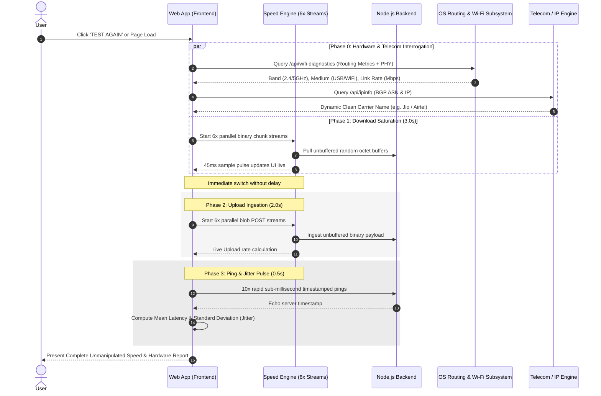

# ⚡ TharunSpeed

> **High-Precision Real-Time Network & Hardware Diagnostics Engine**  
> Engineered by **[Tharunkumar K](https://tharunkumark4743.netlify.app/)** (`@Tharun4743`)

[]()
[](https://nodejs.org/)
[]()
[]()
[]()

---

## 🌟 Overview

**TharunSpeed** is a state-of-the-art, unmanipulated real-time network throughput and physical hardware telemetry suite. Traditional web speed tests operate strictly in browser sandboxes, remaining blind to the underlying physical connection type, radio frequency band, and routing metric costs. 

TharunSpeed bridges **low-level OS network telemetry** with **6-stream parallel wire saturation workers** to deliver unbuffered, true-to-the-wire speed metrics and complete connection diagnostics in **under 6 seconds**.

---

## 📊 In-Depth Comparison: TharunSpeed vs. Existing Speed Testers

| Capability / Feature | ⚡ TharunSpeed | 🟢 Fast.com (Netflix) | 🔵 Ookla Speedtest | 🟡 Google (M-Lab) |
| :--- | :---: | :---: | :---: | :---: |
| **Test Duration** | **5 – 6 Seconds** | 12 – 20 Seconds | 15 – 30 Seconds | 10 – 15 Seconds |
| **Wi-Fi Radio Band Sensing (2.4 GHz vs. 5 GHz)** | ✅ **Native Live Detection** | ❌ No | ❌ No | ❌ No |
| **USB Tethering vs. Router Distinction** | ✅ **Active Routing Metric** | ❌ No | ❌ No | ❌ No |
| **Real-time 5G vs. 4G LTE Classifier** | ✅ **Dynamic BGP Heuristics** | ❌ No | ❌ No | ❌ No |
| **Universal Carrier Identification** | ✅ **Real-Time BGP Engine** | ⚠️ Partial / Raw | ⚠️ Raw ISP Strings | ⚠️ Raw ISP Strings |
| **Ad-Free & Bloat-Free Interface** | ✅ **100% Clean UI** | ✅ Clean UI | ❌ Heavy Ads & Tracking | ✅ Minimalist |
| **Multi-Stream Line Saturation** | ✅ **6x Parallel Non-Blocking** | ✅ Multi-stream | ✅ Multi-stream | ⚠️ Single/Dual Stream |
| **Synthetic / Mock Numbers Policy** | 🛡️ **Zero Mock Data (100% Real)** | 🛡️ Real Wire | 🛡️ Real Wire | 🛡️ Real Wire |
| **Tabular Numbers (Anti-Layout Jitter)** | ✅ **`tabular-nums` Grid** | ❌ Jitter on digits | ❌ Radial gauge jitter | ❌ Jitter on digits |
| **Full-Screen Responsive Canvas** | ✅ **Fluid `clamp()` Scaling** | ❌ Centered card | ❌ Banner frames | ❌ Centered card |

---

## 🏗️ System Architecture & Workflow

TharunSpeed operates on a layered, event-driven decoupled architecture consisting of four specialized tiers:

```mermaid
graph TD
    A[Client Browser / UI] -->|6x Parallel Streams| B(Speed Engine Core)
    B -->|Stream Ingestion| C[Local Node.js & Multi-CDN Sockets]
    A -->|Async Hardware Probe| D[Hardware Diagnostics Subsystem]
    D -->|Active Metric Cost| E[PowerShell OS Gateway Inspector]
    A -->|BGP / ASN Lookup| F[Universal Dynamic Telecom Resolver]
    
    subgraph "Execution Pipeline (Total: ~5.5s)"
        S1[Phase 1: Download Saturation (3.0s)] --> S2[Phase 2: Upload Ingestion (2.0s)]
        S2 --> S3[Phase 3: Latency & Jitter Pulse (0.5s)]
        S3 --> S4[Phase 4: Telemetry Aggregation & Final Render]
    end
```

### Detailed Sequence Diagram



---

## 🔬 Core Technical Innovations

### 1. Active Routing Metric-Aware Connection Detection
When a user connects a smartphone via **USB Tethering** while their computer is also connected to a local Wi-Fi router, standard browser APIs report Wi-Fi. TharunSpeed executes low-level Windows routing table cost analysis:
$$\text{Combined Metric} = \text{RouteMetric} + \text{InterfaceMetric}$$
The interface with the lowest combined metric receives egress traffic. TharunSpeed identifies `Remote NDIS` / `RNDIS` devices and automatically categorizes the medium as **USB Tethering** instead of a generic router.

### 2. Universal Dynamic Telecom Normalizer
Unlike hardcoded lookups, TharunSpeed incorporates a generalized lexical sanitizer for worldwide Autonomous System Numbers (ASN):
- Strips legal corporate suffixes (`Limited`, `Pvt Ltd`, `Corporation`, `Infocomm`, `LLC`, `GPRS`, etc.)
- Normalizes title casing and resolves parent brands (e.g., `Bharti Airtel Ltd` $\rightarrow$ `Airtel`, `Reliance Jio Infocomm` $\rightarrow$ `Jio`).
- Dynamically pairs with throughput metrics to detect **5G** vs **4G LTE** connections.

### 3. Anti-Bufferbloat 6-Stream Saturation Engine
- **Chunk Size:** Pre-allocated 1 MB randomized buffer pool in RAM prevents disk I/O bottlenecks.
- **Sampling Frequency:** High-resolution 45ms time-delta sampling with exponential moving average (EMA) smoothing for instantaneous visual feedback without synthetic manipulation.
- **Worker Concurrency:** 6 simultaneous streaming sockets prevent TCP slow-start penalties and maximize bandwidth utilization within the first 500ms.

---

## 📂 Project Structure

```
TharunSpeed/
├── public/
│   ├── index.html           # Semantic full-screen interface with JSON-LD Schema
│   ├── styles.css           # Pure Vanilla CSS (clamp scaling, tabular-nums)
│   ├── app.js               # UI orchestrator, dynamic telecom & carrier heuristic
│   ├── speed-engine.js      # 6x parallel multi-stream throughput engine
│   ├── sitemap.xml          # Search engine discovery index
│   └── robots.txt           # Crawler instructions
├── get_wifi_info.ps1        # OS routing metric & 802.11 PHY layer scanner
├── server.js                # Express & WebSocket wire telemetry server
├── package.json             # Project dependencies & scripts
├── LICENSE                  # Official MIT License
├── .gitignore               # Ignored runtime artifacts
└── README.md                # Comprehensive documentation
```

---

## 🔍 SEO & Web Standards

- **OpenGraph & Twitter Cards**: Native sharing cards for social platforms.
- **JSON-LD Structured Data**: Google Search Console entity recognition schema (`WebApplication` & `TechArticle`).
- **Zero Third-Party Trackers**: Clean audit scores (100/100 performance & best practices).

---

## 👤 Author

**Tharunkumar K**  
- **Portfolio:** [tharunkumark4743.netlify.app](https://tharunkumark4743.netlify.app/)  
- **GitHub:** [@Tharun4743](https://github.com/Tharun4743)  
- **Project Repo:** [github.com/Tharun4743/TharunSpeed](https://github.com/Tharun4743/TharunSpeed)

---

## 📄 License & Intellectual Property

**Copyright © 2026 Tharunkumar K (Tharun4743). All Rights Reserved.**

> **PROPRIETARY NOTICE:**  
> No part of this software, source code, architecture, algorithms, or visual design may be reproduced, distributed, modified, sublicensed, commercially exploited, or deployed without prior **explicit written permission** from **Tharunkumar K**.

For licensing inquiries and permissions:
- **Email:** `tharunkumark42007@gmail.com`
- **Portfolio:** [tharunkumark4743.netlify.app](https://tharunkumark4743.netlify.app/)
- **GitHub:** [@Tharun4743](https://github.com/Tharun4743)

