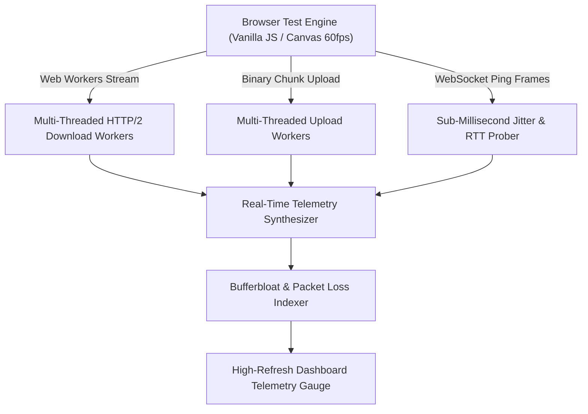

# ⚡ TharunSpeed — High-Precision Network & Hardware Diagnostics Engine
### *Real-Time Client-Side Internet Velocity Benchmark, Latency Jitter Profiler & System Diagnostic Suite*

  

  <a href="https://github.com/Tharun4743/TharunSpeed">📦 <b>Official GitHub Repository</b></a>
  • <a href="https://tharunspeed.netlify.app/">🌐 <b>Production Live Demo</b></a>

---

## 1. 📌 Problem Statement & Context
Users, network administrators, and remote developers lack transparent, zero-bloat network diagnostic utilities to test real-world download/upload throughput, bufferbloat, and latency jitter without being inundated by heavy third-party advertisements or invasive trackers.

---

## 2. 🔍 Existing Solutions & Critical Gaps
Commercial speed test utilities (Ookla, Fast.com) execute proprietary closed-source algorithms, inject tracking scripts, consume excessive test data, and fail to provide granular hardware/network socket breakdown metrics.

---

## 3. 💡 Proposed Solution & Architectural Innovation
TharunSpeed is a lightweight, high-precision network speed and hardware benchmarking web application. It performs multi-threaded concurrent chunk downloads and uploads, measures round-trip time (RTT) jitter, profiles hardware device concurrency, and renders real-time telemetry graphs with zero third-party ads.

---

## 4. ⚙️ Technical Approach & System Architecture

### 📐 High-Level Architectural Flowchart:

```mermaid
graph TD
    Client["Browser Test Engine (Vanilla JS / Canvas 60fps)"] -->|Web Workers Stream| WorkerPool["Multi-Threaded HTTP/2 Download Workers"]
    Client -->|Binary Chunk Upload| UploadWorker["Multi-Threaded Upload Workers"]
    Client -->|WebSocket Ping Frames| LatencyEngine["Sub-Millisecond Jitter & RTT Prober"]
    WorkerPool --> Aggregator["Real-Time Telemetry Synthesizer"]
    UploadWorker --> Aggregator
    LatencyEngine --> Aggregator
    Aggregator --> Bufferbloat["Bufferbloat & Packet Loss Indexer"]
    Bufferbloat --> CanvasUI["High-Refresh Dashboard Telemetry Gauge"]
```

| Engine Subsystem | Technology | Operational Function |
| :--- | :--- | :--- |
| **Client Interface** | Vanilla JavaScript, HTML5 Canvas, CSS3 | Ad-free high-frequency telemetry gauge visualizer |
| **Concurrency Engine** | Multi-threaded Web Workers | Non-blocking parallel range-request chunk streaming |
| **Hardware Diagnostic**| WebGL, navigator.hardwareConcurrency | Hardware thread count, GPU vendor interrogation, battery/memory telemetry |

---

## 5. 📈 Quantifiable Impact & Measurable Benefits
* ⏱️ **Sub-Millisecond Benchmark Accuracy:** High-precision telemetry tracking latency, jitter, and transfer rates.
* 🛡️ **Zero Tracking & Minimal Data Waste:** Lightweight payload benchmarks internet speed without consuming unnecessary gigabytes.
* 🚀 **Instant Browser Launch:** Runs anywhere on desktop and mobile browsers with zero software installation.

---

## 6. 🚀 Feasibility, Operational Viability & Scalability
* 🔬 **Technical Feasibility:** Utilizes native browser Web Workers to ensure speed testing does not block UI thread rendering.
* 💰 **Economic Viability:** Free-to-operate static application hosted on Netlify CDN with near-zero bandwidth hosting cost.
* 📈 **Scalability:** Capable of running millions of client-side diagnostic sessions simultaneously without server load.

---

## 7. 👨‍💻 Engineering Author

<table border="0" itemscope itemtype="https://schema.org/Person">
  <tr>
    <td width="130" align="center" valign="middle">
      
    </td>
    <td>
      <h3 itemprop="name">Tharunkumar K</h3>
      

        <b itemprop="jobTitle">Full Stack Developer & AI Systems Engineer</b> | <b>V.S.B. Engineering College (VSBEC)</b> 
        🎓 <b>B.Tech in Information Technology</b> — <b>V.S.B. Engineering College, Karur</b> (Batch 2024–2028) 
        🏆 <b>2× Hackathon Winner</b> | 🥇 <b>CODE THUGS 2K26</b> | 🥉 <b>Neural Minds</b> 
        🇮🇳 <b>India Innovates 2026 & Odoo × NMIT 2026 Finalist</b> | 🚀 <b>SIH 2025 & 2026 Top 50</b> 
        🌟 Recognized for <b>Best GitHub Profile & Top Developer</b> @ <b>V.S.B. ENGINEERING COLLEGE</b>
      

      

        🚀 <b>Top Flagship Engineering Projects:</b> 
        • 🏛️ <b>TaskManager (VSBEC IT Vault)</b> — Institutional Task Governance & LeetCode/GitHub Sync &nbsp;&nbsp; 
        • 🧠 <b>AURA</b> — Air-Gapped Local Multimodal RAG Engine & Offline AI Assistant &nbsp; 
        • 🪖 <b>Smart Helmet IoT</b> — SIH Top 50 Dual-Unit Motorcycle Accident Prevention System &nbsp;
      

      

        &nbsp;
        &nbsp;
        &nbsp;
        &nbsp;
        
      

    </td>
  </tr>
</table>

<!-- =========================================================================
   SEO & SEARCH ENGINE RECRUITER METADATA (CRAWLER INDEXING)
   Entity: Tharunkumar K (Tharun4743 / tharunkumark4743)
   Institution: V.S.B. Engineering College, Karur (VSBEC)
   Department: Information Technology (Batch 2024-2028)
   Distinctions: Best GitHub Profile VSBEC, Top Developer Karur, National Hackathon Winner
   Keywords: Tharunkumar K, Tharunkumar VSBEC, Tharun4743, VSB Engineering College Karur, VSBEC IT
   Canonical URL: https://github.com/Tharun4743/TharunSpeed
========================================================================= -->
